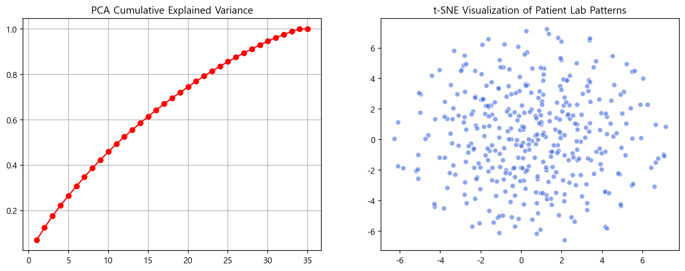

# EMR 기반 입원 기간 예측 및 임상 신호 탐색
Synthea 합성 EMR 정형 데이터 — 검사 수치 패턴과 입원 기간(LOS)의 관계 분석

---

## 프로젝트 특징

사전에 정의된 문제가 아닌, **데이터 탐색 과정에서 분석 방향을 직접 설계한 프로젝트.**

초기에는 진단 코드 기반 분류를 시도했으나 Long-tail 분포로 중단,<br>
재입원 패턴 분석은 인과 추적 불가로 방향 전환.<br>
최종적으로 "검사 수치의 단순 평균이 환자 상태를 충분히 포착하는가"라는 가설을 설정하고<br>
피처 설계 → EDA → 모델링 → SHAP 해석까지 전 과정을 직접 구성했다.

---

## 핵심 결과

SHAP 분석 결과, `Total_Abnormal_Count`(전체 이상 소견 누적) 단일 변수가<br>
143개 피처 전체 기여의 **70.1%** 를 차지.

단순 검사 평균(Lab_Mean 계열)의 기여도는 **10.1%** 로 최하위.<br>
→ **"단순 평균은 임상 신호를 충분히 포착하지 못한다"는 가설 실증**

| 모델 | R² (Test) | MAE | CV R² |
|------|-----------|-----|-------|
| Linear Regression | 0.825 | 1.697일 | 0.712 ± 0.068 |
| Random Forest (Tuned) | 0.916 | 1.157일 | **0.890 ± 0.035** |
| **XGBoost** | **0.918** | **1.123일** | 0.872 ± 0.030 |

---

## 분석 방향 전환 배경

초기 시도한 두 가지 방향 모두 데이터 구조적 한계로 중단됨.

- **진단 코드 분류**: PrimaryDiagnosisCode Long-tail 분포 → 클래스 불균형으로 분류 모델 구축 불가
- **재입원 패턴 분석**: 동일 환자 반복 입원이 임상 맥락 없이 독립 이벤트 처리 → 인과 추적 불가

→ **검사 데이터 기반 생리적 불안정성 ↔ LOS** 관계 분석으로 초점 전환

---

## 피처 설계 — 왜 단순 평균이 아닌가

| 피처 그룹 | 설계 의도 | 피처 수 |
|-----------|-----------|---------|
| `Lab_Mean_{검사명}` | 기준 비교용 단순 평균 | 35 |
| `Lab_Std_{검사명}` | 개별 검사 변동성 | 35 |
| `Lab_Trend_{검사명}` | 수치 악화/호전 방향 | 35 |
| `Abnormal_Sum_{검사명}` | 검사 단위 이상 소견 누적 | 35 |
| **`Total_Abnormal_Count`** | **환자 전체 중증도 → SHAP 1위 (70.1%)** | 1 |
| `Total_Lab_Variability` | 환자 단위 전반 변동성 | 1 |
| `LabTestVariety` | 검사 종류 다양성 | 1 |

> `LabTestCount` 제외: LOS와 r=0.993으로 역인과 관계 의심.<br>
> 제거 후에도 XGBoost R²=0.918 달성 → 순수 임상 신호만으로 예측 가능 확인.

---

## EDA — 탐색 결과가 피처 설계 근거가 됨

| 분석 | 결과 | 의미 |
|------|------|------|
| PCA | PC1 설명력 7.0% | 지배적 구조 없음 — 단순 평균으로 환자 구분 불가 |
| t-SNE | 균일 분포, 군집 없음 | 평균 수치 기반 환자 분리 불가 |
| K-Means | K=2에서만 미약한 분리 | 임상적으로 의미 있는 자연 군집 없음 |

→ PCA / t-SNE / K-Means 결과가 "평균 기반 표현의 한계"를 직접 실증<br>
→ 구조적 파생변수 필요성의 정량적 근거로 활용



---

## SHAP — 모델을 해석 도구로 활용


`Total_Abnormal_Count` SHAP 기여값 4.203 vs 2위 변수 0.133 **(31배 차이)**

---

## 프로젝트 구조

```
Basic_Health_Care/
├── notebooks/
│   ├── 01_data_overview.ipynb              # 데이터 탐색 — 구조 파악 및 방향 탐색
│   ├── 02_feature_engineering.ipynb        # 143개 구조적 피처 설계
│   ├── 03_exploratory_data_analysis.ipynb  # PCA / t-SNE / K-Means
│   ├── 04_modeling.ipynb                   # 3모델 비교 + SHAP 해석
│   └── appendix_detailed_analysis.ipynb   # 변수별 상세 탐색 (참고용)
├── src/
│   ├── feature_engineering.py              # 피처 생성 모듈
│   └── modeling.py                         # 모델링 + SHAP 모듈
├── outputs/figures/                        # 시각화 결과물
├── data/
│   ├── raw/                                # 원본 EMR 텍스트 파일 4종
│   └── processed/                          # 전처리 완료 데이터
├── docs/analysis_summary.md               # 분석 전체 흐름 요약
└── requirements.txt
```

**Tech Stack** `Python` `pandas` `scikit-learn` `XGBoost` `SHAP` `matplotlib` `seaborn` `scipy`

**Data** [Synthea 합성 EMR](https://github.com/csbond007/Basic_Health_Care) —<br>
환자 100명 / 입원 372건 / 검사 결과 111,483건
