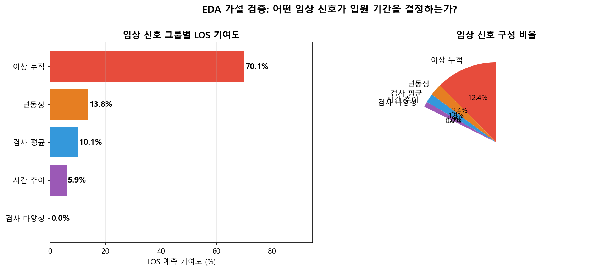
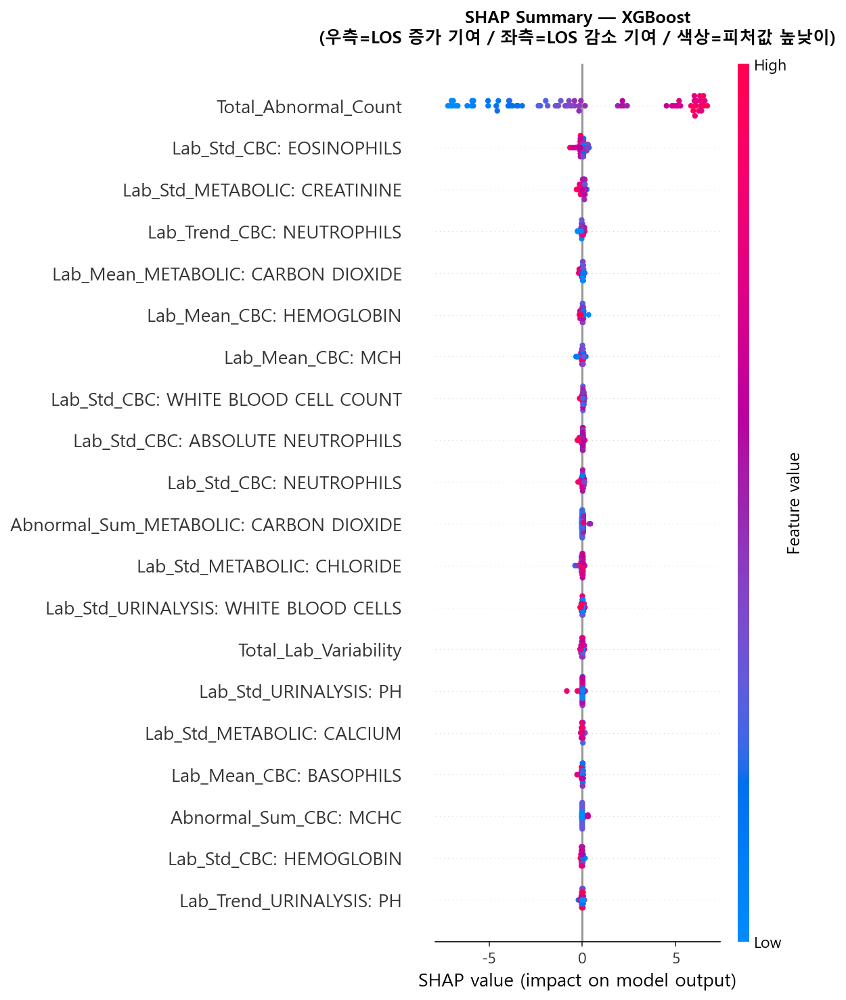
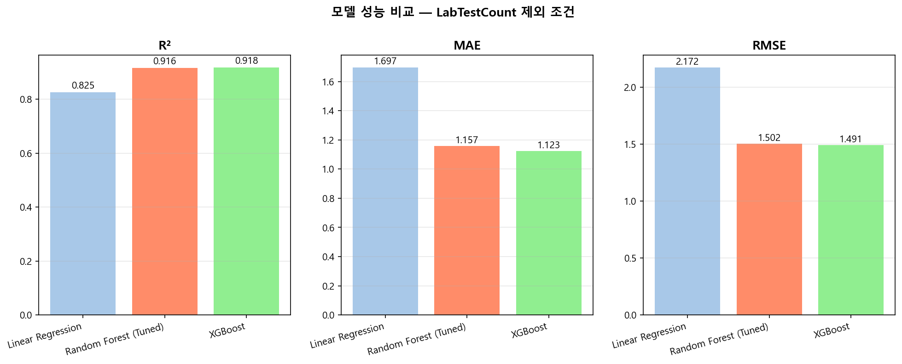
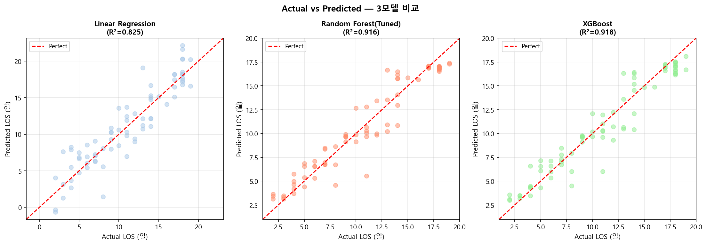
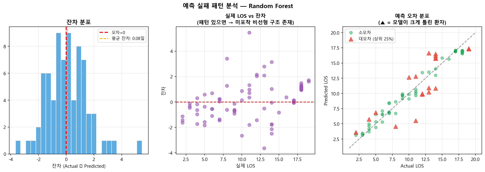

# EMR-based Length of Stay Prediction & Clinical Signal Analysis

**EMR 정형 데이터 기반 입원 기간 예측 및 임상 신호 탐색**

[](https://www.python.org/)
[](LICENSE)

---

## Overview

EMR(Electronic Medical Record) 정형 데이터를 활용하여  
환자의 검사 수치 패턴이 입원 기간(Length of Stay, LOS)에 어떤 임상 신호를 제공하는지 탐색한다.

**핵심 가설:**  
단일 검사 수치의 평균값은 환자 상태를 충분히 설명하지 못한다.  
검사의 **이상 소견 누적**, **변동성**, **시간적 추이**와 같은 구조적 지표가  
LOS와 더 밀접하게 연관될 것이다.

**분석 결과 요약:**  
SHAP 분석으로 이 가설을 실증했다.  
`Total_Abnormal_Count`(전체 이상 소견 누적) 단일 변수가 143개 피처 SHAP 합계의 **70.1%** 를 차지했으며,  
검사 평균값 그룹(Lab_Mean 계열)의 기여도는 **10.1%** 로 최하위였다.

---

## Dataset

| 항목 | 내용 |
|------|------|
| 출처 | [csbond007/Basic_Health_Care](https://github.com/csbond007/Basic_Health_Care) (Synthea 기반 합성 EMR) |
| 기간 | 1941–2013년 |
| 환자 수 | 100명 |
| 입원 기록 | 372건 |
| 검사 결과 | 111,483건 |
| 분석 단위 | 입원(Admission) 단위 — 4개 테이블 병합 |

### 분석 방향 전환 배경

- 진단 코드(PrimaryDiagnosisCode)는 Long-tail 분포로 분류 모델 구축 불가
- 재입원 기록이 임상 맥락 없이 독립 이벤트로 처리되어 인과 추적 불가
- → **검사 데이터 기반 생리적 불안정성 ↔ LOS 관계 분석**으로 초점 전환

---

## Repository Structure

```
Basic_Health_Care/
├── data/                          # 원본 EMR 데이터 (Synthea 생성)
│   ├── PatientCorePopulatedTable.txt
│   ├── AdmissionsCorePopulatedTable.txt
│   ├── AdmissionsDiagnosesCorePopulatedTable.txt
│   └── LabsCorePopulatedTable.txt
├── notebooks/                     # 분석 단계별 Jupyter Notebook
│   ├── 01_data_overview.ipynb
│   ├── 02_feature_engineering.ipynb
│   ├── 03_exploratory_data_analysis.ipynb
│   └── 04_modeling.ipynb
├── outputs/
│   ├── processed_healthcare_data.csv
│   └── figures/
│       ├── eda_demographics.png
│       ├── eda_pca_tsne.png
│       ├── eda_kmeans.png
│       ├── eda_cluster_viz.png
│       ├── model_comparison.png
│       ├── actual_vs_predicted.png
│       ├── shap_summary.png
│       ├── shap_group_contribution.png
│       ├── shap_dependence.png
│       └── residual_analysis.png
├── src/                           # 재사용 가능한 Python 모듈
│   ├── feature_engineering.py
│   └── modeling.py
├── docs/                          # 분석 요약 문서
│   └── analysis_summary.md
├── .gitignore
├── requirements.txt
└── README.md
```

---

## Analysis Pipeline

```
4개 원본 EMR 테이블
        │
        ▼
[01] 데이터 탐색
     결측치 · 분포 · 테이블 관계 확인
        │
        ▼
[02] Feature Engineering
     HoursAfterAdmission / Lab_Trend / Abnormal_Sum
     Total_Abnormal_Count / Total_Lab_Variability
        │
        ▼
[03] EDA
     PCA (PC1 설명력 7.0%) → 지배적 구조 없음
     t-SNE → 자연 군집 없음
     K-Means → K=2에서만 미약한 분리
     → 단순 평균 기반 표현의 한계 실증
        │
        ▼
[04] Modeling + XAI
     ┌─ Part 1: 예측
     │   Baseline: Linear Regression  (R²=0.825)
     │   Main:     Random Forest Tuned (R²=0.916, CV R²=0.890)
     │   Best:     XGBoost            (R²=0.918, MAE=1.12일)
     │
     └─ Part 2: 해석 (모델 → 임상 신호 발굴 도구)
         SHAP → Total_Abnormal_Count 압도적 1위 (전체의 70.1%)
         그룹별 기여도 → 이상 누적 vs 검사 평균(10.1%) 대비
         Dependence Plot → 효과 형태(선형/임계점) 탐색
         잔차 분석 → 극단 LOS 케이스 오차 집중 확인
```

---

## Feature Engineering

| 피처 | 설명 | 설계 의도 |
|------|------|-----------|
| `HoursAfterAdmission` | 입원 후 검사 경과 시간 | Trend 계산 기반 |
| `Lab_Mean_{검사명}` | 검사 수치 평균 | 기준 비교용 |
| `Lab_Std_{검사명}` | 검사 수치 표준편차 | 개별 변동성 |
| `Lab_Trend_{검사명}` | 선형회귀 기울기 | 수치 악화/호전 방향 |
| `Abnormal_Sum_{검사명}` | 검사별 이상 소견 누적 | 검사 단위 중증도 |
| `Total_Abnormal_Count` | **전체 이상 소견 합산** | **환자 전반적 중증도 → SHAP 1위** |
| `Total_Lab_Variability` | 환자 단위 전반 변동성 | 생리적 불안정성 |
| `LabTestVariety` | 검사 종류 다양성 | 진료 강도 |

> `LabTestCount`(총 검사 횟수)는 r=0.993의 극단적 LOS 상관을 보이나  
> 역인과 관계가 강하게 의심되므로 모델 피처에서 **제외**했다.  
> 제거 후에도 XGBoost R²=0.918 달성 → 순수 임상 신호만으로 예측 가능.

최종 모델 피처: **143개** (이상 누적 36 + 변동성 36 + 추이 35 + 평균 35 + 다양성 1)

---

## Key Results

### Model Performance

| 모델 | R² (Test) | MAE | RMSE | CV R² (5-Fold) |
|------|-----------|-----|------|----------------|
| Linear Regression | 0.825 | 1.697일 | 2.172 | 0.712 ± 0.068 |
| Random Forest (Tuned) | 0.916 | 1.157일 | 1.502 | **0.890 ± 0.035** |
| **XGBoost** | **0.918** | **1.123일** | **1.491** | 0.872 ± 0.030 |

- XGBoost가 Test Set 기준 최우수, CV R²는 RF가 근소하게 높음 → **소규모 데이터 특성상 두 모델 실질적으로 동등**
- LR 대비 트리 계열 R² 격차 +0.09 → **비선형 구조 존재 확인**

### SHAP — Clinical Signal Contribution

| 피처 그룹 | 기여도 | 해석 |
|-----------|--------|------|
| **이상 소견 누적 (Abnormal)** | **70.1%** | `Total_Abnormal_Count` 단독으로 압도 (2위의 31배) |
| 변동성 (Std/Variability) | — | 검사 수치 불안정성 반영 |
| 시간 추이 (Trend) | — | 수치 악화/호전 방향 |
| **검사 평균 (Mean)** | **10.1%** | **최하위 — 단순 평균의 한계 실증** |





### Model Comparison





### Prediction Error Analysis

- 잔차 평균: **0.077일** (무편향)  
- 잔차 std: **1.500일**  
- 대오차 케이스: **19건** (Test 75건의 25%) — 극단 LOS에서 집중



---

## Limitations & Future Work

| 한계 | 설명 | 개선 방향 |
|------|------|-----------|
| Synthea 합성 데이터 | 실제 임상 복잡성 미반영 | MIMIC-III 등 실제 EHR 검증 |
| 소규모 (100명 / 372건) | 외부 일반화 제한 | 대규모 데이터 재검증 |
| 사후 분석 | 입원 완료 데이터 기반 | 초기 N일 기반 조기 예측 모델 전환 |
| 진단 정보 미반영 | Long-tail 분포로 피처 제외 | 진단 코드 임베딩 + 동반 상병 추가 |

---

## Quick Start

```bash
git clone https://github.com/tashydean/Basic_Health_Care.git
cd Basic_Health_Care
pip install -r requirements.txt
jupyter notebook notebooks/01_data_overview.ipynb
```

---

## Tech Stack

`Python 3.8+` · `pandas` · `numpy` · `scikit-learn` · `xgboost` · `shap` · `matplotlib` · `seaborn`

---

## Author

**[@tashydean](https://github.com/tashydean)**
